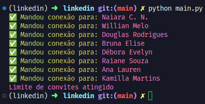

# 🚀 Automação de Conexões no LinkedIn e Raspagem de Vagas

## 📌 Descrição
Este projeto automatiza interações no LinkedIn e realiza raspagem de dados de vagas na área de TI. O foco principal é networking estratégico, com possibilidade de envio de mensagens personalizadas e compartilhamento de vagas via Telegram ou webhook.

## ✨ Funcionalidades
- 📩 **Automação de conexões no LinkedIn** (limite de 100 por semana).
- 💬 **Envio opcional de mensagens personalizadas** junto à solicitação *(ainda a fazer)*.
- 🎯 **Segmentação de conexões** (interesses similares ou recrutadores).
- 🔍 **Raspagem de vagas de TI** *(opcional)*.

## ⚙️ Tecnologias Utilizadas
- Python (Playwright)

## 🚀 Como Executar
1. Clone o repositório:
   ```bash
   git clone https://github.com/Isaac-Foster/linkedin_bot.git
   ```
 2. Configure as credenciais no `.env`:
    ```
    # Login used only once to generate the session and save
    login=""
    passwd=""

    #name of the folder to save the login session made
    dir_name="accounts/__your_path_name"

    # name of the folder to save the login session made
    # Mode select if add people (1) or add people with note (2) LIMIT 5 or 10 INVITES free user premium not limit invites
    search='IT Recruiter'
    mode=1

    template = """
    hi {name} my name is <your_name> generic text
    """
    ```


3. Instale as dependências:
   ```bash
   uv sync
   ```
4. Caso seja a primeira vez executando.
    ```bash 
    playwright install
    ```
5. Execute o script principal:
   ```bash
   python main.py
   ```

### Retorno visual no terminal


## 📌 Observações
- A busca por empregos **não é o foco principal** do projeto.
- O RPA pode ser ajustado conforme necessidades específicas.

## 📄 Licença
Este projeto está sob a licença MIT. Sinta-se à vontade para contribuir! 😊
